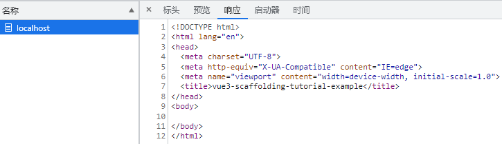
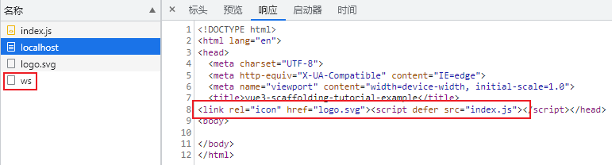
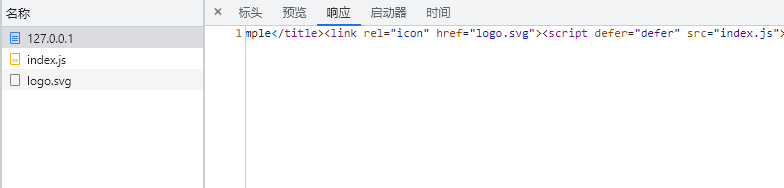

# Webpack

先把webpack包及其命令行工具安装了。  
为了后续便于维护，我们专门建一个webpack目录。
```shell
npm i -D webpack webpack-cli 

mkdir webpack
```
::: tip
我们这里使用的`webpack`版本为`v5.74.0`
:::

接着创建`webpack/webpack.base.js`文件以及我们指向的入口文件`src/index.js`。

```js
// webpack/webpack.base.js
const path = require('path');

module.exports = {
  entry: {
    index: path.resolve(__dirname, '../src/index.js'),
  },
  output: {
    path: path.resolve(__dirname, '../dist'),
  }
}

// src/index.js
console.log('hello world!');
```


再创建`webpack/webpack.dev.js`、`webpack/webpack.prod.js`，针对于开发和生产环境的配置文件。


这里我们需要使用webpack-merge插件来合并配置项，webpack-dev-server用于提供开发环境服务。

```shell
npm i -D webpack-merge webpack-dev-server
```


```js
// webpack/webpack.dev.js
const webpackMerge = require('webpack-merge');
const baseConfig = require('./webpack.base');
const path = require('path');

module.exports = webpackMerge.merge(baseConfig, {
  mode: 'development',
  devServer: {
    host: '0.0.0.0',
    port: 3000
  },
});

// webpack/webpack.prod.js
const webpackMerge = require('webpack-merge');
const baseConfig = require('./webpack.base');

module.exports = webpackMerge.merge(baseConfig, {
  mode: 'production'
});
```
再将开发和构建的命令加入到package.json。
```json {2-3}
"scripts": {
  "dev": "webpack serve --config webpack/webpack.dev.js",
  "build": "webpack --config webpack/webpack.prod.js"
},
```

尝试执行下命令`npm run dev`



结果我们看到它只是拿到我们本地的`public/index.html`静态文件，并没有绑定`src/index.js`。  
所以这里我们需要用到一个webpack插件`html-webpack-plugin`来生成已绑定的`index.html`。
```shell
npm i -D html-webpack-plugin
```
```js {3,12-17}
// webpack.base.js
const path = require("path");
const HtmlWebpackPlugin = require("html-webpack-plugin");

module.exports = {
  entry: {
    index: path.resolve(__dirname, '../src/index.js'),
  },
  output: {
    path: path.resolve(__dirname, '../dist'),
  },
  plugins: [
    new HtmlWebpackPlugin({
      template: path.resolve(__dirname, '../public/index.html'), 
      favicon: path.resolve(__dirname, '../public/logo.svg'), // 顺便加入favicon
    }),
  ]
}
```
由于它是生成在output指定的dist目录，所以我们还需配置webpack-dev-server的静态目录为dist。
```js {5-7}
// webpack.dev.js
devServer: {
  host: '0.0.0.0',
  port: 3000,
  static: {
    directory: path.join(__dirname, '../dist')
  }
},
```
接着再执行`npm run dev`我们则会看到已经绑定上了。



顺带一提，这个ws实际上就是`webpack-dev-server`的热更新的通讯原理，通过`websocket`侦测代码的变化，从而通知本地server进行更新。

再执行`npm run build`试试。
```shell
npm run build
npm install -g http-server 
http-server dist # 这里我们借助http-server访问dist来验证结果
```



结果如我们所愿跟dev的呈现结果一致，只是进一步对`index.html`做了压缩。
