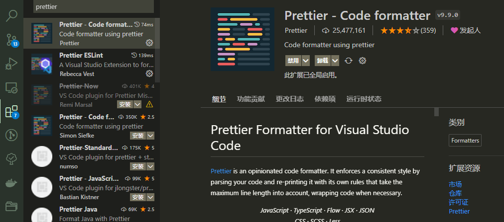
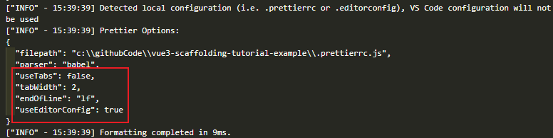

# Prettier
这个痛点能够使用Prettier来解决，Prettier是通过结合eslint的规则来进行修复。

接着我们来安装`prettier`，以及创建它的配置文件`.prettierrc.js`。
```shell
npm i -D prettier
```
```js
// .prettierrc.js
module.exports = {}
```
`Prettier`和`ESLint`完全不一样，它的默认配置并非是零，而是每个选项都有默认值，所以我们直接不进行配置即可。

加入一段代码来验证下效果
```js {5-11}
console.log("hello world!");
const test = 123;
console.log(test);

let   a   = 1;
const     b   =       2
const   c   = 333;
console.log('result'
  ,a,
  b,
  c)
```
执行如下命令即可生效
```shell
npx prettier --write .\src\index.js
```
```js
console.log("hello world!");
const test = 123;
console.log(test);

let a = 1;
const b = 2;
const c = 333;
console.log("result", a, b, c);
```

通过命令来修复特别麻烦，所以我们通过结合编辑器插件来自动修复。

::: tip
这里以`Visual Studio Code`为例来安装插件和配置
:::



在**vscode插件商店**搜索`prettier`即可找到对应插件，安装完后我们需要创建vscode的项目配置文件`.vscode/settings.json`来覆盖默认配置。
```json
// .vscode/settings.json
{
  "editor.formatOnSave": true,
  "editor.defaultFormatter": "esbenp.prettier-vscode"
}
```
配置了**保存时格式化**、**使用prettier格式化**两项，现在再保存文件就会自动使用prettier格式化了。

这时你会发现`.eslintrc.js`文件保存时也被格式化了，之前的注释也不那么整齐了。
```js
// .eslintrc.js
module.exports = {
  env: {
    browser: true, // 支持浏览器环境
    node: true, // 识别 CommonJS
    es6: true, // 识别 ES 的代码
  },
  // 继承ESLint的规则集
  extends: [
    "eslint:recommended", // ESLint自带
  ],
};
```
我们可以创建一个`.prettierignore`忽略文件来跳过指定文件或目录：
```js
// .prettierignore
.eslintrc.js
```
这样一来就不会被格式化了。

最后我们顺便将编辑器风格配置文件`.editorconfig`也集成到`prettier`中。
```js
// .editorconfig
root = true

[*]
end_of_line = lf
charset = utf-8
indent_style = space
indent_size = 2
trim_trailing_whitespace = true
insert_final_newline = true
tab_width = 4

[*.md]
trim_trailing_whitespace = false

[Makefile]
indent_style = tab
```
```js {3}
// .prettierrc.js
module.exports = {
  useEditorConfig: true,
};
```
下图在vscode的Prettier插件输出中也可以看出配置生效了。

