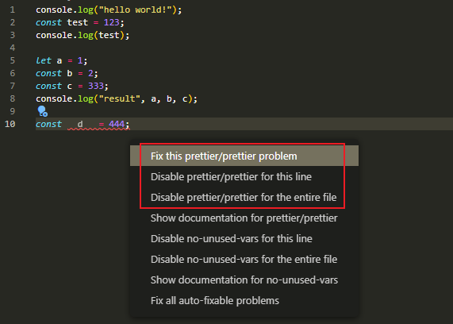

# ESLint & Prettier

前面已经配置好了Prettier，接着就是将ESLint的规则使用到Prettier的格式化中。

需要安装两个插件：
```shell
npm i -D eslint-plugin-prettier eslint-config-prettier
```
- `eslint-plugin-prettier`作用是添加prettier的代码风格规则，使用prettier来自动修复代码
- `eslint-config-prettier`作用是用来禁用掉eslint部分与prettier相冲突的规则的
```js {11}
// .eslintrc.js
module.exports = {
  env: {
    browser: true,  // 支持浏览器环境
    node: true,     // 识别 CommonJS
    es6: true,      // 识别 ES 的代码
  },
  // 继承ESLint的规则集
  extends: [
    "eslint:recommended",           // ESLint自带
    "plugin:prettier/recommended"   // Prettier
  ]
};
```
这时`error`的修复选项就会有`prettier`了。


