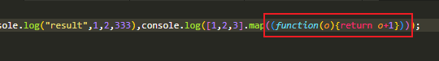

# Babel & Webpack
配置好babel后还需要借助Webpack来对js文件进行构建转换，需要安装`babel-loader`来配置。
```shell
npm i -D babel-loader
```

```js {15-25}
// webpack.base.js
module.exports = {
  entry: {
    index: path.resolve(__dirname, "../src/index.js"),
  },
  output: {
    path: path.resolve(__dirname, "../dist"),
  },
  plugins: [
    new HtmlWebpackPlugin({
      template: path.resolve(__dirname, "../public/index.html"),
      favicon: path.resolve(__dirname, "../public/logo.svg"),
    }),
  ],
  module: {
    rules: [
      {
        test: /\.js$/,
        exclude: /node_modules/,
        use: {
          loader: "babel-loader"
        },
      },
    ],
  },
};
```
这样一来`babel-loader`就会自动使用`babel.config.js`的配置了，我们添加ES6语法验证一下。
```js {11}
// src/index.js
console.log("hello world!");
const test = 123;
console.log(test);

let a = 1;
const b = 2;
const c = 333;
console.log("result", a, b, c);

console.log([1, 2, 3].map((n) => n + 1)); // 使用ES6箭头函数
```
接着执行`npm run build`看看构建结果



可以看到成功将`ES6的箭头函数`转换成`ES5的匿名函数`。