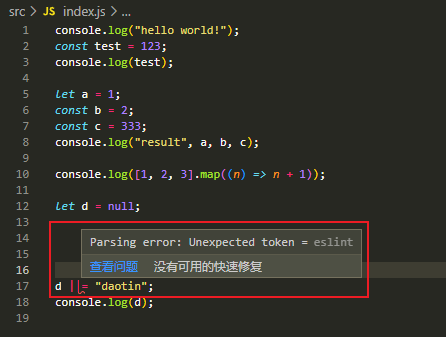
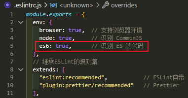

# Babel & ESLint
前面可以知道我们能够使用哪种版本的ES6语法取决于babel的配置，但有没想过那eslint检查的是哪个版本的ES6语法？

如果版本不一致，可能会导致`babel支持`某个ES6语法而`eslint不支持`时反而出现报错的情况。

例如下面使用ES2021的语法ESLint就会提示解析错误：
```js {13-15}
// src/index.js
console.log("hello world!");
const test = 123;
console.log(test);

let a = 1;
const b = 2;
const c = 333;
console.log("result", a, b, c);

console.log([1, 2, 3].map((n) => n + 1));

let d = null;
d ||= "daotin";
console.log(d);
```



下面我们再看看构建会不会有问题：
```shell
npm run build
```


可以看出来webpack通过babel的配置一样能够转换ES2021的语法，主要原因是在于`@babel/preset-env`默认就是支持最新的ES语法。


而ESLint会报错的原因是在于我们配置的是ES6版本的语法，也就是2015的版本。



这个时候可以通过配置`es2021`来支持这个版本的语法：
```js {6}
// .eslintrc.js
module.exports = {
  env: {
    browser: true,  // 支持浏览器环境
    node: true,     // 识别 CommonJS
    es2021: true,   // 识别 ES 的代码
  },
  // 继承ESLint的规则集
  extends: [
    "eslint:recommended",           // ESLint自带
    "plugin:prettier/recommended"   // Prettier
  ]
};
```
但是这样还是没办法完全避免版本不一致的问题，最好的方法还是两者使用同一种配置，所以我们需要用到插件`@babel/eslint-parser`来解决这个问题。
```shell
npm i -D @babel/eslint-parser
```
```js {13-28}
// .eslintrc.js
module.exports = {
  env: {
    browser: true,  // 支持浏览器环境
    node: true,     // 识别 CommonJS
    es2021: true,   // 识别 ES 的代码
  },
  // 继承ESLint的规则集
  extends: [
    "eslint:recommended",           // ESLint自带
    "plugin:prettier/recommended"   // Prettier
  ],
  overrides: [
    {
      files: ["**/*.{js,jsx}"],          // 只处理 js 和 jsx 文件
      parser: "@babel/eslint-parser",    // 使用 babel 来解析 js 文件
      parserOptions: {
        sourceType: "module",            // 支持 import/export
        allowImportExportEverywhere: false,
        ecmaFeatures: {
          globalReturn: false,
        },
        babelOptions: {
          configFile: './babel.config.js', // 指定babel配置文件
        },
      },
    }
  ]
};
```
这样一来就可以用一个`babel.config.js`文件来配置`Webpack`的构建和`ESLint`的代码检查了。
