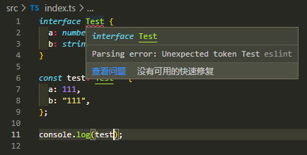

# TypeScript
通过前面的`babel`配置，终于可以肆意使用最新版的ES语法了。但是如今大部分企业实际上都在使用`TypeScript`了，而且对代码的可维护性、壮健性都有很大的提升。  
所以我们这里也需要对`TypeScript`也做下支持，首先通过命令创建`tsconfig.json`配置文件。
```shell
# 创建tsconfig.json
npx tsc --init
```
```json
// 修改tsconfig.json
{
  "compilerOptions": {
    "target": "esnext",
    "useDefineForClassFields": true,
    "module": "esnext",
    "moduleResolution": "node",
    "baseUrl": "./",
    "sourceMap": true,
    "allowSyntheticDefaultImports": true,
    "esModuleInterop": true,
    "forceConsistentCasingInFileNames": true,
    "strict": true,
    "alwaysStrict": true,
    "skipLibCheck": true
  }
}
```
创建个TS文件试试：
```ts
// src/index.ts
interface Test {
  a: number;
  b: string;
}

const test: Test = {
  a: 111,
  b: "111",
};

console.log(test);
```



结果ESLint这边解析出了问题，那后面我们加上ESLint的检测吧。