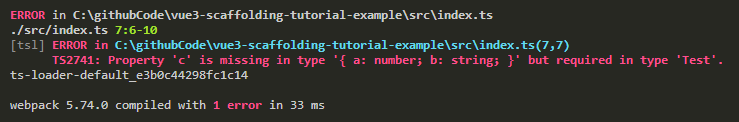

# TypeScript & Webpack
现在光能用`TypeScript`写代码还不行，还得让`Webpack`支持TS转JS才行。  
之前我们ES6转ES5时是让`Webpack`通过`Babel`配置来转换，这次`TypeScript`也可以通过`Babel`配置给`Webpack`转换。
```shell
npm i -D @babel/preset-typescript
```
```js {12-14}
// babel.config.js
module.exports = {
  presets: [
    [
      "@babel/preset-env", // ES
      {
        targets: {
          browsers: ["> 0.25%", "not dead"],
        },
      },
    ],
    [
      "@babel/preset-typescript", // TS
    ],
  ],
};
```
对应的`Webpack配置入口`和`babel-loader解析后缀`都需要修改。
```js {7,21}
// webpack.base.js
const path = require("path");
const HtmlWebpackPlugin = require("html-webpack-plugin");

module.exports = {
  entry: {
    index: path.resolve(__dirname, "../src/index.ts"),
  },
  output: {
    path: path.resolve(__dirname, "../dist"),
  },
  plugins: [
    new HtmlWebpackPlugin({
      template: path.resolve(__dirname, "../public/index.html"),
      favicon: path.resolve(__dirname, "../public/logo.svg"),
    }),
  ],
  module: {
    rules: [
      {
        test: /\.(js|ts)$/,
        exclude: /node_modules/,
        use: {
          loader: "babel-loader"
        },
      },
    ],
  },
};
```
到这里再去执行`npm run build`就会发现构建没有问题了。  

前面使用`@babel/preset-typescript`进行转换的方式的优点在于**构建效率快**，但缺点是**缺少类型检查**。  
为了兼容不同的使用人群，这边也介绍下使用`ts-loader`的方式，优点是**具有类型检查**，缺点则是**构建效率较慢**。

```shell
npm i -D ts-loader
```
```js {28-34}
// webpack.base.js
const path = require("path");
const HtmlWebpackPlugin = require("html-webpack-plugin");

module.exports = {
  entry: {
    index: path.resolve(__dirname, "../src/index.ts"),
  },
  output: {
    path: path.resolve(__dirname, "../dist"),
  },
  plugins: [
    new HtmlWebpackPlugin({
      template: path.resolve(__dirname, "../public/index.html"),
      favicon: path.resolve(__dirname, "../public/logo.svg"),
    }),
  ],
  module: {
    rules: [
      {
        // test: /\.(js|ts)$/,
        test: /\.(js)$/,
        exclude: /node_modules/,
        use: {
          loader: "babel-loader"
        },
      },
      {
        test: /\.tsx?$/,
        loader: 'ts-loader',
        exclude: /node_modules/,
        options: {
          configFile: path.resolve(process.cwd(), 'tsconfig.json')
        },
      },
    ],
  },
};
```
```shell
npm run dev # 构建看看效果
```
这个时候我们再尝试写下错误的类型，就会看到终端会出现报错信息。
```ts {5}
// src/index.ts
interface Test {
  a: number;
  b: string;
  c: string;
}

const test: Test = {
  a: 111,
  b: "111",
};

console.log(test);
```



最后总结下，这里我们介绍了两种方式来转换TS：
- `@babel/preset-typescript` 这种方式的好处在于**构建效率快**，但缺点是**缺少类型检查**。
- `ts-loader` 这种方式的优点是构建时会**进行类型检查**，但**构建效率慢**。
::: tip
本项目使用的是`ts-loader`
:::
具体使用哪种方式来转换TS，就看个人的取舍了，这里不做推荐。
