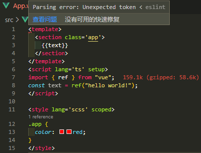

# Vue & ESLint



在`src/App.vue`可以看到`ESLint`还无法识别`vue`的写法规则，所以还需要要配置下`ESLint`。

先来安装对应插件`eslint-plugin-vue`和`vue-eslint-parser`：
```shell
npm i -D eslint-plugin-vue vue-eslint-parser
```
- `eslint-plugin-vue` 针对vue文件的规则和插件
- `vue-eslint-parser` 让ESLint识别vue文件
接着来配置ESLint
```js {6-10}
// ./eslintrc.js
module.exports = {
  ...
  overrides: [
    ...
    {
      files: ["**/*.vue"],                    // 只处理 vue 文件
      parser: "vue-eslint-parser",            // 解析Vue
      extends: ["plugin:vue/vue3-essential"], // 使用vue3的推荐规则
    }
  ]
};
```