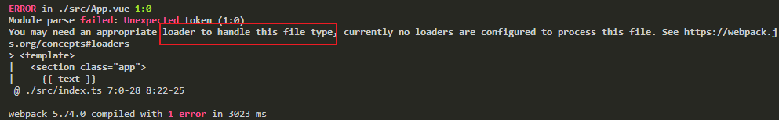

# Vue & TypeScript


在`src/index.ts`可以看到`TypeScript`还无法识别`vue`组件类型，所以还需要**手动**新建文件`src/@types/shims-vue.d.ts`给`vue`文件声明下类型。

```ts
// src/@types/shims-vue.d.ts
declare module "*.vue" {
  import { ComponentOptions } from "vue";
  const componentOptions: ComponentOptions;
  export default componentOptions;
}
```
接着执行`npm run dev`看下效果：



报错信息可以看出还缺少`loader`来转换`vue`文件类型，下一节我们来配置`Webpack`。
