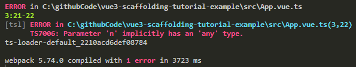

# Vue & Webpack

先安装对应插件`vue-loader`、`vue-template-compiler`。
```shell 
npm i -D vue-loader vue-template-compiler
```
- `vue-template-compiler` 将`vue模板`预编译成`render函数`。
- `vue-loader` 结合`vue-template-compiler`将`vue文件`转换为`js文本`。

接着配置`Webpack`文件:
```js {14,17-20}
// webpack.base.js
...
module.exports = {
  ...
  module: {
    rules: [
      ...
      {
        test: /\.tsx?$/,
        loader: 'ts-loader',
        exclude: /node_modules/,
        options: {
          configFile: path.resolve(process.cwd(), 'tsconfig.json'),
          appendTsSuffixTo: [/\.vue$/]  // vue内部使用ts
        },
      },
      {
        test: /\.vue$/,
        loader: 'vue-loader',
      }
    ],
  },
};
```

由于我们使用了`Sass`，这里还得安装针对`Sass`的`Webpack`插件：
```shell
npm i -D vue-style-loader css-loader
npm i -D sass-loader node-sass 
```
```js {8-15}
// webpack.base.js
...
module.exports = {
  ...
  module: {
    rules: [
      ...
      {
        test: /\.scss$/,
        use: [
          'vue-style-loader',
          'css-loader',
          'sass-loader'
        ]
      }
    ],
  },
};
```
执行`npm run dev`看看效果



这个报错的原因是由于`vue-loader`未提供具体类型给`TypeScript`导致的，`vue-loader`版本为`v17.0.0`。目前[`Issues`](https://github.com/vuejs/vue-loader/issues/1915)还未有官方答复，我们暂时通过`ignoreDiagnostics`来解决：

```js {15}
// webpack.base.js
...
module.exports = {
  ...
  module: {
    rules: [
      ...
      {
        test: /\.tsx?$/,
        loader: 'ts-loader',
        exclude: /node_modules/,
        options: {
          configFile: path.resolve(process.cwd(), 'tsconfig.json'),
          appendTsSuffixTo: [/\.vue$/],  // vue内部使用ts
          ignoreDiagnostics: [7006]  // 针对vue-loader的bug
        },
      },
      ...
    ],
  },
};
```

这时再执行构建就会看到预期的效果：
```shell
npm run dev
# or
npm run build
http-server dist
```


