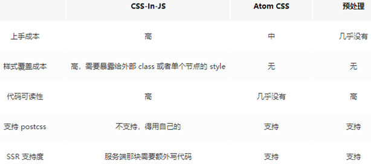
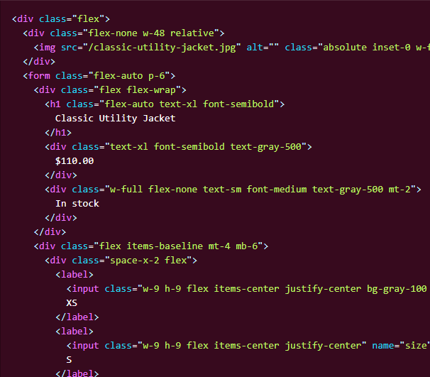

# CSS方案的选择

单纯地使用css来书写样式有一系列的缺点，比如`选择器同名导致样式覆盖`、`样式规则重复率高`、`书写效率低`等。

目前前端领域比较知名的方案有三类：
- `CSS模块化` 通过CSS-in-JS的方式来嵌入样式，能够非常灵活地使用CSS，但上手成本较高。
- `CSS原子化` 极大化地减少样式地重复率，也可以提高书写效率，但缺点也非常明显，就是可读性极差，也有一定的上手成本。
- `CSS预处理器` 通过预处理器提高书写效率，也能更好地管理css规则，上手成本基本没有。

这里有一张图可以充分说明它们的特点：

不太推荐使用`CSS-in-JS`这种方式，写css还需要另外学对应API，本身就是一种本末倒置的方式，并且写法上也并没有提高多少效率。

反观`CSS原子化`是一个极度追求书写效率的方式，也极大地提高了复用性，但是可读性太差了，不利于维护。下面给张图大家感受下：

当然不可否认，这种方式能够极大地提高效率，可以在一些敏捷开发的场景可以用用，但是在中大型项目还是不太推荐。  

最后这里推荐使用`CSS预处理器`，灵活度也高，复用性可以自己配置，上手成本也低。
