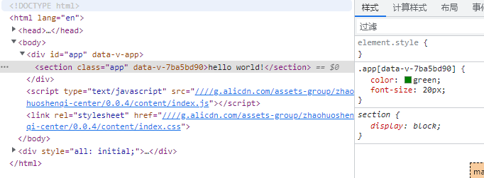

# Sass & Webpack
在前面我们已经在`Webpack`配置了`sass-loader`，接着我们需要使用Sass全局配置，以便于使用Sass Mixin、Sass Variables等特性。

先创建一个样式文件`src/assets/css/variables.scss`，以及给`src/App.vue`添加上样式。
```scss
// src/assets/css/variables.scss
@charset "UTF-8";
$color1: green;

@mixin size($size){
	font-size: $size;
}

// src/App.vue
.app {
  color: $color1;
  @include size(20px);
}
```

再来修改`Webpack`的配置，让它在全局中引入。
```js {4-9,19-24}
// webpack/webpack.base.js
module.exports = {
  ...
  resolve: {
    alias: {
      // 添加别名，可以简写
      '@': path.resolve(__dirname, '../src'),
    }
  },
  ...
  module: {
    rules: [
      ...
      {
        test: /\.scss$/,
        use: [
          'vue-style-loader',
          'css-loader',
          {
            loader: 'sass-loader',
            options: {
              additionalData: `@import "@/assets/css/variables";`,
            },
          },
        ]
      }
    ],
  },
};
```
这时我们再执行`npm run dev`就可以看到已经生效了：


