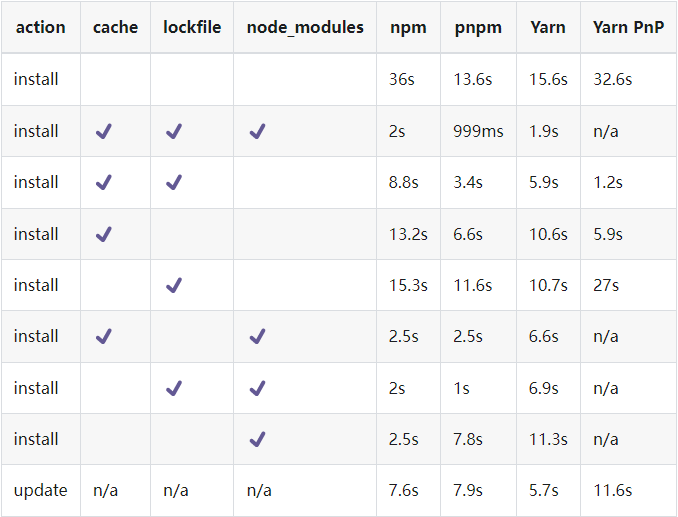

# Pnpm


之前我们用的包管理器是NPM，但是具有诸多的缺点：
- `重复依赖` 项目依赖a和b，同时a和b都依赖c，那么会导致安装两个c分别在a和b的目录下。
- `幽灵依赖` 项目依赖a，a依赖b，但未限制项目直接使用b。（升级a可能会删除b，不应该让项目直接使用b）
- `算法耗时长` 由于使用的是嵌套结构，需要使用算法来进行扁平化，导致耗时更长。
- ...

尤其是项目功能非常复杂的时候，一旦要删除`node_modules`或者`npm install`那就会花费大量实际在**等待**，特别是在屡次安装删除失败的时候累计起来耗时就不是一点半点了。


而`pnpm`使用的是另外一套管理依赖包的方法，使用`软链`来进行管理，速度会更快。简单地说，就是它会将依赖包存放在统一的位置，通过软链来映射，不同版本则只会保存有区别的文件。  

下面可以看看对比图：



使用`pnpm`也很简单，先全局安装`pnpm`包。
```shell
npm install -g pnpm
```
接着只需要稍微改变下使用方式即可：
| npm命令 | pnpm命令 |
| :--- | :--- |
| npm install | `pnpm install` |
| npm install ... | `pnpm add ...` |
| npm run ...	| `pnpm ...` | 
