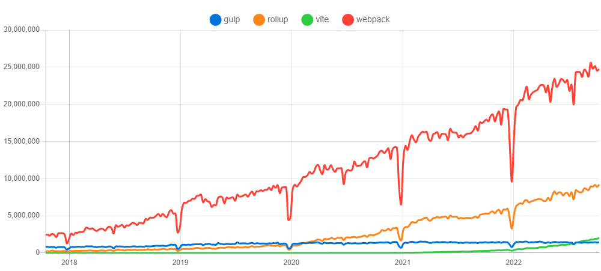

# 待整理

## .gitignore的来源及作用


## 创建.gitignore
github官方提供了不同环境下的[.gitignore模板集合](https://github.com/github/gitignore)  
我们这里直接使用提供的`Node.gitignore`即可。


## 构建工具的选择
既然是企业级脚手架，那么肯定得选择比较成熟且稳定的工具。  
目前市场上比较合适的选项有：webpack、rollup、gulp


...

无论从市场或功能层面，webpack都比较适合我们的场景。

## Webpack

先把webpack包及其命令行工具安装了。  
为了后续便于维护，我们专门建一个webpack目录。
```shell
npm i -D webpack webpack-cli 

mkdir webpack
```

接着创建`webpack/webpack.base.js`文件

...

再创建`webpack/webpack.dev.js`、`webpack/webpack.prod.js`，针对于开发和生产环境的配置文件

...


这里我们需要使用webpack-merge插件来合并配置项，webpack-dev-server用于提供开发环境服务。

```shell
npm i -D webpack-merge webpack-dev-server

```

由于我们设置static目录为dist，所以还需要将public/index.html转移到dist/index.html


由于某些情况下window配置环境变量会出现问题，保险起见我们也安装下cross-env，它主要是支持跨平台运行设置和使用环境变量的脚本。

```shell
npm i -D cross-env

```
