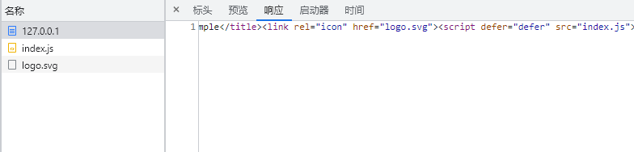

# 待整理

## .gitignore的来源及作用


## 创建.gitignore
github官方提供了不同环境下的[.gitignore模板集合](https://github.com/github/gitignore)  
我们这里直接使用提供的`Node.gitignore`即可。


## 构建工具的选择
既然是企业级脚手架，那么肯定得选择比较成熟且稳定的工具。  
目前市场上比较合适的选项有：webpack、rollup、gulp


...

无论从市场或功能层面，webpack都比较适合我们的场景。

## Webpack

先把webpack包及其命令行工具安装了。  
为了后续便于维护，我们专门建一个webpack目录。
```shell
npm i -D webpack webpack-cli 

mkdir webpack
```
::: tip
我们这里使用的`webpack`版本为`v5.74.0`
:::

接着创建`webpack/webpack.base.js`文件以及我们指向的入口文件`src/index.js`。

```js
// webpack/webpack.base.js
const path = require('path');

module.exports = {
  entry: {
    index: path.resolve(__dirname, '../src/index.js'),
  },
  output: {
    path: path.resolve(__dirname, '../dist'),
  }
}

// src/index.js
console.log('hello world!');
```


再创建`webpack/webpack.dev.js`、`webpack/webpack.prod.js`，针对于开发和生产环境的配置文件。


这里我们需要使用webpack-merge插件来合并配置项，webpack-dev-server用于提供开发环境服务。

```shell
npm i -D webpack-merge webpack-dev-server
```


```js
// webpack/webpack.dev.js
const webpackMerge = require('webpack-merge');
const baseConfig = require('./webpack.base');
const path = require('path');

module.exports = webpackMerge.merge(baseConfig, {
  mode: 'development',
  devServer: {
    host: '0.0.0.0',
    port: 3000
  },
});

// webpack/webpack.prod.js
const webpackMerge = require('webpack-merge');
const baseConfig = require('./webpack.base');

module.exports = webpackMerge.merge(baseConfig, {
  mode: 'production'
});
```
再将开发和构建的命令加入到package.json。
```json {2-3}
"scripts": {
  "dev": "webpack serve --config webpack/webpack.dev.js",
  "build": "webpack --config webpack/webpack.prod.js"
},
```

尝试执行下命令`npm run dev`


结果我们看到它只是拿到我们本地的`public/index.html`静态文件，并没有绑定`src/index.js`。  
所以这里我们需要用到一个webpack插件`html-webpack-plugin`来生成已绑定的`index.html`。
```shell
npm i -D html-webpack-plugin
```
```js {9-14}
// webpack.base.js
module.exports = {
  entry: {
    index: path.resolve(__dirname, '../src/index.js'),
  },
  output: {
    path: path.resolve(__dirname, '../dist'),
  },
  plugins: [
    new HtmlWebpackPlugin({
      template: path.resolve(__dirname, '../public/index.html'), 
      favicon: path.resolve(__dirname, '../public/logo.svg'), // 顺便加入favicon
    }),
  ]
}
```
由于它是生成在output指定的dist目录，所以我们还需配置webpack-dev-server的静态目录为dist。
```js {5-7}
// webpack.dev.js
devServer: {
  host: '0.0.0.0',
  port: 3000,
  static: {
    directory: path.join(__dirname, '../dist')
  }
},
```
接着再执行`npm run dev`我们则会看到已经绑定上了。


顺带一提，这个ws实际上就是`webpack-dev-server`的热更新的通讯原理，通过`websocket`侦测代码的变化，从而通知本地server进行更新。

再执行`npm run build`试试。
```shell
npm run build
npm install -g http-server 
http-server dist # 这里我们借助http-server访问dist来验证结果
```



结果如我们所愿跟dev的呈现结果一致，只是进一步对`index.html`做了压缩。


## ESLint

到这里我们算是把最基础的构建部分给弄好了。  
既然要构建企业级的脚手架，代码的规范性肯定也少不了，这里我们选取当下前端最热门的代码规范检查工具`ESLint`。

接着我们安装`eslint`以及创建它的配置文件`.eslintrc.js`，顺便也把`.eslintignore`忽略文件也创建了
```shell
npm i -D eslint
```
```js
// .eslintrc.js
module.exports = {
  env: {
    browser: true,  // 支持浏览器环境
    node: true,     // 识别 CommonJS
    es6: true,      // 识别 ES 的代码
  },
  // 继承ESLint的规则集
  extends: [
    "eslint:recommended",           // ESLint自带
  ]
};

// .eslintignore  需要时再添加配置项

```


我们要知道ESLint规则默认配置是**没有限制**的也就是**无规则**的，需要什么规范我们就自己手动去配置里加规则，这里使用了`eslint`自身提供的规则集`eslint:recommended`。


随意在`src/index.js`里加代码试试效果。
```js {2}
console.log('hello world!');
const test = 123;
```


这里可以看到提示信息违反了规则`no-unused-vars`，也就是不允许声明未使用的变量，再手动加上去使用就可以避免违反规则了。

```js {3}
console.log('hello world!');
const test = 123;
console.log(test);
```


但我们想象一下，如果每次有违反规则的时候我们都得手动去修复是不是特别麻烦？况且我们一般都是统一用业界写好的规则集，没有多少人会特地去熟悉这么多的规则。

那这个痛点我们该怎么来解决呢？

## ----ESLint & Webpack
https://zhuanlan.zhihu.com/p/347103745


## Prettier
这个痛点能够使用Prettier来解决，Prettier是通过结合eslint的规则来进行修复。

接着我们来安装`prettier`，以及创建它的配置文件`.prettierrc.js`。
```shell
npm i -D prettier
```
```js
// .prettierrc.js
module.exports = {}
```
`Prettier`和`ESLint`完全不一样，它的默认配置并非是零，而是每个选项都有默认值，所以我们直接不进行配置即可。

加入一段代码来验证下效果
```js {5-11}
console.log("hello world!");
const test = 123;
console.log(test);

let   a   = 1;
const     b   =       2
const   c   = 333;
console.log('result'
  ,a,
  b,
  c)
```
执行如下命令即可生效
```shell
npx prettier --write .\src\index.js
```
```js
console.log("hello world!");
const test = 123;
console.log(test);

let a = 1;
const b = 2;
const c = 333;
console.log("result", a, b, c);
```

通过命令来修复特别麻烦，所以我们通过结合编辑器插件来自动修复。

::: tip
这里以`Visual Studio Code`为例来安装插件和配置
:::


在**vscode插件商店**搜索`prettier`即可找到对应插件，安装完后我们需要创建vscode的项目配置文件`.vscode/settings.json`来覆盖默认配置。
```json
// .vscode/settings.json
{
  "editor.formatOnSave": true,
  "editor.defaultFormatter": "esbenp.prettier-vscode"
}
```
配置了**保存时格式化**、**使用prettier格式化**两项，现在再保存文件就会自动使用prettier格式化了。

这时你会发现`.eslintrc.js`文件保存时也被格式化了，之前的注释也不那么整齐了。
```js
// .eslintrc.js
module.exports = {
  env: {
    browser: true, // 支持浏览器环境
    node: true, // 识别 CommonJS
    es6: true, // 识别 ES 的代码
  },
  // 继承ESLint的规则集
  extends: [
    "eslint:recommended", // ESLint自带
  ],
};
```
我们可以创建一个`.prettierignore`忽略文件来跳过指定文件或目录：
```js
// .prettierignore
.eslintrc.js
```
这样一来就不会被格式化了。

最后我们顺便将编辑器风格配置文件`.editorconfig`也集成到`prettier`中。
```js
// .editorconfig
root = true

[*]
end_of_line = lf
charset = utf-8
indent_style = space
indent_size = 2
trim_trailing_whitespace = true
insert_final_newline = true
tab_width = 4

[*.md]
trim_trailing_whitespace = false

[Makefile]
indent_style = tab
```
```js {3}
// .prettierrc.js
module.exports = {
  useEditorConfig: true,
};
```
下图在vscode的Prettier插件输出中也可以看出配置生效了。


## Prettier & ESLint

前面已经配置好了Prettier，接着就是将ESLint的规则使用到Prettier的格式化中。

需要安装两个插件：
```shell
npm i -D eslint-plugin-prettier eslint-config-prettier
```
- `eslint-plugin-prettier`作用是添加prettier的代码风格规则，使用prettier来自动修复代码
- `eslint-config-prettier`作用是用来禁用掉eslint部分与prettier相冲突的规则的
```js {11}
// .eslintrc.js
module.exports = {
  env: {
    browser: true,  // 支持浏览器环境
    node: true,     // 识别 CommonJS
    es6: true,      // 识别 ES 的代码
  },
  // 继承ESLint的规则集
  extends: [
    "eslint:recommended",           // ESLint自带
    "plugin:prettier/recommended"   // Prettier
  ]
};
```
这时`error`的修复选项就会有`prettier`了。


## ----Prettier & Webpack


## Babel
到这里得开始关注自身代码的需求了，大多数项目最基础也需要使用到ES6语法了。虽然目前有好一部分浏览器都支持，但是难免会有某些不支持的情况，最好的做法全部转成`ES5`再给浏览器解析。

我们选择目前非常热门的ES编译器`Babel`来进行转换，需要安装`@babel/core`和`@babel/preset-env`两个插件和创建`babel.config.js`配置文件。

```shell
npm i -D @babel/core @babel/preset-env 
```
```js
// babel.config.js
module.exports = {
  presets: [
    [
      "@babel/preset-env", // ES
      {
        targets: {
          browsers: ["> 0.25%", "not dead"],
        },
      },
    ],
  ],
};
```

## Babel & Webpack
配置好babel后还需要借助Webpack来对js文件进行构建转换，需要安装`babel-loader`来配置。
```shell
npm i -D babel-loader
```

```js {15-25}
// webpack.base.js
module.exports = {
  entry: {
    index: path.resolve(__dirname, "../src/index.js"),
  },
  output: {
    path: path.resolve(__dirname, "../dist"),
  },
  plugins: [
    new HtmlWebpackPlugin({
      template: path.resolve(__dirname, "../public/index.html"),
      favicon: path.resolve(__dirname, "../public/logo.svg"),
    }),
  ],
  module: {
    rules: [
      {
        test: /\.js$/,
        exclude: /node_modules/,
        use: {
          loader: "babel-loader"
        },
      },
    ],
  },
};
```
这样一来`babel-loader`就会自动使用`babel.config.js`的配置了，我们添加ES6语法验证一下。
```js {11}
// src/index.js
console.log("hello world!");
const test = 123;
console.log(test);

let a = 1;
const b = 2;
const c = 333;
console.log("result", a, b, c);

console.log([1, 2, 3].map((n) => n + 1)); // 使用ES6箭头函数
```
接着执行`npm run build`看看构建结果


可以看到成功将`ES6的箭头函数`转换成`ES5的匿名函数`。

## Babel & ESLint
前面可以知道我们能够使用哪种版本的ES6语法取决于babel的配置，但有没想过那eslint检查的是哪个版本的ES6语法？

如果版本不一致，可能会导致`babel支持`某个ES6语法而`eslint不支持`时反而出现报错的情况。

例如下面使用ES2021的语法ESLint就会提示解析错误：
```js {13-15}
// src/index.js
console.log("hello world!");
const test = 123;
console.log(test);

let a = 1;
const b = 2;
const c = 333;
console.log("result", a, b, c);

console.log([1, 2, 3].map((n) => n + 1));

let d = null;
d ||= "daotin";
console.log(d);
```


下面我们再看看构建会不会有问题：
```shell
npm run build
```


可以看出来webpack通过babel的配置一样能够转换ES2021的语法，主要原因是在于`@babel/preset-env`默认就是支持最新的ES语法。


而ESLint会报错的原因是在于我们配置的是ES6版本的语法，也就是2015的版本。


这个时候可以通过配置`es2021`来支持这个版本的语法：
```js {6}
// .eslintrc.js
module.exports = {
  env: {
    browser: true,  // 支持浏览器环境
    node: true,     // 识别 CommonJS
    es2021: true,   // 识别 ES 的代码
  },
  // 继承ESLint的规则集
  extends: [
    "eslint:recommended",           // ESLint自带
    "plugin:prettier/recommended"   // Prettier
  ]
};
```
但是这样还是没办法完全避免版本不一致的问题，最好的方法还是两者使用同一种配置，所以我们需要用到插件`@babel/eslint-parser`来解决这个问题。
```shell
npm i -D @babel/eslint-parser
```
```js {13-28}
// .eslintrc.js
module.exports = {
  env: {
    browser: true,  // 支持浏览器环境
    node: true,     // 识别 CommonJS
    es2021: true,   // 识别 ES 的代码
  },
  // 继承ESLint的规则集
  extends: [
    "eslint:recommended",           // ESLint自带
    "plugin:prettier/recommended"   // Prettier
  ],
  overrides: [
    {
      files: ["**/*.{js,jsx}"],          // 只处理 js 和 jsx 文件
      parser: "@babel/eslint-parser",    // 使用 babel 来解析 js 文件
      parserOptions: {
        sourceType: "module",            // 支持 import/export
        allowImportExportEverywhere: false,
        ecmaFeatures: {
          globalReturn: false,
        },
        babelOptions: {
          configFile: './babel.config.js', // 指定babel配置文件
        },
      },
    }
  ]
};
```
这样一来就可以用一个`babel.config.js`文件来配置`Webpack`的构建和`ESLint`的代码检查了。


## TypeScript
通过前面的`babel`配置，终于可以肆意使用最新版的ES语法了。但是如今大部分企业实际上都在使用`TypeScript`了，而且对代码的可维护性、壮健性都有很大的提升。  
所以我们这里也需要对`TypeScript`也做下支持，首先通过命令创建`tsconfig.json`配置文件。
```shell
# 创建tsconfig.json
npx tsc --init
```
```json
// 修改tsconfig.json
{
  "compilerOptions": {
    "target": "esnext",
    "useDefineForClassFields": true,
    "module": "esnext",
    "moduleResolution": "node",
    "baseUrl": "./",
    "sourceMap": true,
    "allowSyntheticDefaultImports": true,
    "esModuleInterop": true,
    "forceConsistentCasingInFileNames": true,
    "strict": true,
    "alwaysStrict": true,
    "skipLibCheck": true
  }
}
```
创建个TS文件试试：
```ts
// src/index.ts
interface Test {
  a: number;
  b: string;
}

const test: Test = {
  a: 111,
  b: "111",
};

console.log(test);
```


结果ESLint这边解析出了问题，那后面我们加上ESLint的检测吧。

## TypeScirpt & ESLint
首先得安装相应的三个插件`typescript`、`@typescript-eslint/parser`、`@typescript-eslint/eslint-plugin`。
```shell
npm install -D 
  typescript # TypeScript
  @typescript-eslint/parser # TypeScript 解析器
  @typescript-eslint/eslint-plugin # TypeScript 规则集和插件功能
```
再来修改ESLint配置文件
```js {6-17}
// .eslintrc.js
module.exports = {
  ...
  overrides: [
    ...
    {
      files: ["**/*.{ts,tsx}"],              // 只处理 ts 和 tsx 文件
      parser: "@typescript-eslint/parser",   // 解析 TypeScript
      parserOptions: {
        project: ["./tsconfig.json"],        // 指定ts配置文件
      },
      extends: [
        "plugin:@typescript-eslint/recommended",                          // 官方语法检查
        "plugin:@typescript-eslint/recommended-requiring-type-checking",  // 类型检查
      ],
      plugins: ["@typescript-eslint"],
    }
  ]
};
```
这下你会发现之前`src/index.ts`的ESLint报错提示消失了。

## TypeScript & Webpack
现在光能用`TypeScript`写代码还不行，还得让`Webpack`支持TS转JS才行。  
之前我们ES6转ES5时是让`Webpack`通过`Babel`配置来转换，这次`TypeScript`也可以通过`Babel`配置给`Webpack`转换。
```shell
npm i -D @babel/preset-typescript
```
```js {12-14}
// babel.config.js
module.exports = {
  presets: [
    [
      "@babel/preset-env", // ES
      {
        targets: {
          browsers: ["> 0.25%", "not dead"],
        },
      },
    ],
    [
      "@babel/preset-typescript", // TS
    ],
  ],
};
```
对应的`Webpack配置入口`和`babel-loader解析后缀`都需要修改。
```js {7,21}
// webpack.base.js
const path = require("path");
const HtmlWebpackPlugin = require("html-webpack-plugin");

module.exports = {
  entry: {
    index: path.resolve(__dirname, "../src/index.ts"),
  },
  output: {
    path: path.resolve(__dirname, "../dist"),
  },
  plugins: [
    new HtmlWebpackPlugin({
      template: path.resolve(__dirname, "../public/index.html"),
      favicon: path.resolve(__dirname, "../public/logo.svg"),
    }),
  ],
  module: {
    rules: [
      {
        test: /\.(js|ts)$/,
        exclude: /node_modules/,
        use: {
          loader: "babel-loader"
        },
      },
    ],
  },
};
```
到这里再去执行`npm run build`就会发现构建没有问题了。  

前面使用`@babel/preset-typescript`进行转换的方式的优点在于**构建效率快**，但缺点是**缺少类型检查**。  
为了兼容不同的使用人群，这边也介绍下使用`ts-loader`的方式，优点是**具有类型检查**，缺点则是**构建效率较慢**。

```shell
npm i -D ts-loader
```
```js {28-32}
// webpack.base.js
const path = require("path");
const HtmlWebpackPlugin = require("html-webpack-plugin");

module.exports = {
  entry: {
    index: path.resolve(__dirname, "../src/index.ts"),
  },
  output: {
    path: path.resolve(__dirname, "../dist"),
  },
  plugins: [
    new HtmlWebpackPlugin({
      template: path.resolve(__dirname, "../public/index.html"),
      favicon: path.resolve(__dirname, "../public/logo.svg"),
    }),
  ],
  module: {
    rules: [
      {
        // test: /\.(js|ts)$/,
        test: /\.(js)$/,
        exclude: /node_modules/,
        use: {
          loader: "babel-loader"
        },
      },
      {
        test: /\.tsx?$/,
        use: 'ts-loader',
        exclude: /node_modules/,
      },
    ],
  },
};
```
```shell
npm run dev # 构建看看效果
```
这个时候我们再尝试写下错误的类型，就会看到终端会出现报错信息。
```ts {5}
// src/index.ts
interface Test {
  a: number;
  b: string;
  c: string;
}

const test: Test = {
  a: 111,
  b: "111",
};

console.log(test);
```


最后总结下，这里我们介绍了两种方式来转换TS：
- `@babel/preset-typescript` 这种方式的好处在于**构建效率快**，但缺点是**缺少类型检查**。
- `ts-loader` 这种方式的优点是构建时会**类型检查**，但**构建效率慢**。

具体使用哪种方式来转换TS，就看个人的取舍了，这里不做推荐。


## ----


由于某些情况下window配置环境变量会出现问题，保险起见我们也安装下cross-env，它主要是支持跨平台运行设置和使用环境变量的脚本。

```shell
npm i -D cross-env

```
