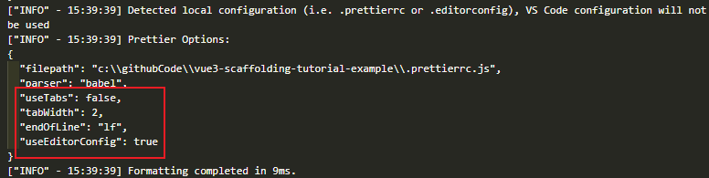
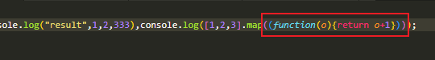
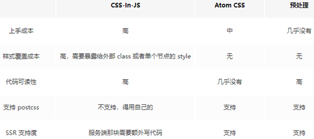

# 待整理

## 构建工具的选择
既然是企业级脚手架，那么肯定得选择比较成熟且稳定的工具。  
目前市场上比较合适的选项有：webpack、rollup、gulp


...

无论从市场或功能层面，webpack都比较适合我们的场景。

## Webpack

先把webpack包及其命令行工具安装了。  
为了后续便于维护，我们专门建一个webpack目录。
```shell
npm i -D webpack webpack-cli 

mkdir webpack
```
::: tip
我们这里使用的`webpack`版本为`v5.74.0`
:::

接着创建`webpack/webpack.base.js`文件以及我们指向的入口文件`src/index.js`。

```js
// webpack/webpack.base.js
const path = require('path');

module.exports = {
  entry: {
    index: path.resolve(__dirname, '../src/index.js'),
  },
  output: {
    path: path.resolve(__dirname, '../dist'),
  }
}

// src/index.js
console.log('hello world!');
```


再创建`webpack/webpack.dev.js`、`webpack/webpack.prod.js`，针对于开发和生产环境的配置文件。


这里我们需要使用webpack-merge插件来合并配置项，webpack-dev-server用于提供开发环境服务。

```shell
npm i -D webpack-merge webpack-dev-server
```


```js
// webpack/webpack.dev.js
const webpackMerge = require('webpack-merge');
const baseConfig = require('./webpack.base');
const path = require('path');

module.exports = webpackMerge.merge(baseConfig, {
  mode: 'development',
  devServer: {
    host: '0.0.0.0',
    port: 3000
  },
});

// webpack/webpack.prod.js
const webpackMerge = require('webpack-merge');
const baseConfig = require('./webpack.base');

module.exports = webpackMerge.merge(baseConfig, {
  mode: 'production'
});
```
再将开发和构建的命令加入到package.json。
```json {2-3}
"scripts": {
  "dev": "webpack serve --config webpack/webpack.dev.js",
  "build": "webpack --config webpack/webpack.prod.js"
},
```

尝试执行下命令`npm run dev`


结果我们看到它只是拿到我们本地的`public/index.html`静态文件，并没有绑定`src/index.js`。  
所以这里我们需要用到一个webpack插件`html-webpack-plugin`来生成已绑定的`index.html`。
```shell
npm i -D html-webpack-plugin
```
```js {9-14}
// webpack.base.js
module.exports = {
  entry: {
    index: path.resolve(__dirname, '../src/index.js'),
  },
  output: {
    path: path.resolve(__dirname, '../dist'),
  },
  plugins: [
    new HtmlWebpackPlugin({
      template: path.resolve(__dirname, '../public/index.html'), 
      favicon: path.resolve(__dirname, '../public/logo.svg'), // 顺便加入favicon
    }),
  ]
}
```
由于它是生成在output指定的dist目录，所以我们还需配置webpack-dev-server的静态目录为dist。
```js {5-7}
// webpack.dev.js
devServer: {
  host: '0.0.0.0',
  port: 3000,
  static: {
    directory: path.join(__dirname, '../dist')
  }
},
```
接着再执行`npm run dev`我们则会看到已经绑定上了。


顺带一提，这个ws实际上就是`webpack-dev-server`的热更新的通讯原理，通过`websocket`侦测代码的变化，从而通知本地server进行更新。

再执行`npm run build`试试。
```shell
npm run build
npm install -g http-server 
http-server dist # 这里我们借助http-server访问dist来验证结果
```


结果如我们所愿跟dev的呈现结果一致，只是进一步对`index.html`做了压缩。


## ESLint

到这里我们算是把最基础的构建部分给弄好了。  
既然要构建企业级的脚手架，代码的规范性肯定也少不了，这里我们选取当下前端最热门的代码规范检查工具`ESLint`。

接着我们安装`eslint`以及创建它的配置文件`.eslintrc.js`，顺便也把`.eslintignore`忽略文件也创建了
```shell
npm i -D eslint
```
```js
// .eslintrc.js
module.exports = {
  env: {
    browser: true,  // 支持浏览器环境
    node: true,     // 识别 CommonJS
    es6: true,      // 识别 ES 的代码
  },
  // 继承ESLint的规则集
  extends: [
    "eslint:recommended",           // ESLint自带
  ]
};

// .eslintignore  需要时再添加配置项

```


我们要知道ESLint规则默认配置是**没有限制**的也就是**无规则**的，需要什么规范我们就自己手动去配置里加规则，这里使用了`eslint`自身提供的规则集`eslint:recommended`。


随意在`src/index.js`里加代码试试效果。
```js {2}
console.log('hello world!');
const test = 123;
```


这里可以看到提示信息违反了规则`no-unused-vars`，也就是不允许声明未使用的变量，再手动加上去使用就可以避免违反规则了。

```js {3}
console.log('hello world!');
const test = 123;
console.log(test);
```


但我们想象一下，如果每次有违反规则的时候我们都得手动去修复是不是特别麻烦？况且我们一般都是统一用业界写好的规则集，没有多少人会特地去熟悉这么多的规则。

那这个痛点我们该怎么来解决呢？

## ----ESLint & Webpack
https://zhuanlan.zhihu.com/p/347103745


## Prettier
这个痛点能够使用Prettier来解决，Prettier是通过结合eslint的规则来进行修复。

接着我们来安装`prettier`，以及创建它的配置文件`.prettierrc.js`。
```shell
npm i -D prettier
```
```js
// .prettierrc.js
module.exports = {}
```
`Prettier`和`ESLint`完全不一样，它的默认配置并非是零，而是每个选项都有默认值，所以我们直接不进行配置即可。

加入一段代码来验证下效果
```js {5-11}
console.log("hello world!");
const test = 123;
console.log(test);

let   a   = 1;
const     b   =       2
const   c   = 333;
console.log('result'
  ,a,
  b,
  c)
```
执行如下命令即可生效
```shell
npx prettier --write .\src\index.js
```
```js
console.log("hello world!");
const test = 123;
console.log(test);

let a = 1;
const b = 2;
const c = 333;
console.log("result", a, b, c);
```

通过命令来修复特别麻烦，所以我们通过结合编辑器插件来自动修复。

::: tip
这里以`Visual Studio Code`为例来安装插件和配置
:::


在**vscode插件商店**搜索`prettier`即可找到对应插件，安装完后我们需要创建vscode的项目配置文件`.vscode/settings.json`来覆盖默认配置。
```json
// .vscode/settings.json
{
  "editor.formatOnSave": true,
  "editor.defaultFormatter": "esbenp.prettier-vscode"
}
```
配置了**保存时格式化**、**使用prettier格式化**两项，现在再保存文件就会自动使用prettier格式化了。

这时你会发现`.eslintrc.js`文件保存时也被格式化了，之前的注释也不那么整齐了。
```js
// .eslintrc.js
module.exports = {
  env: {
    browser: true, // 支持浏览器环境
    node: true, // 识别 CommonJS
    es6: true, // 识别 ES 的代码
  },
  // 继承ESLint的规则集
  extends: [
    "eslint:recommended", // ESLint自带
  ],
};
```
我们可以创建一个`.prettierignore`忽略文件来跳过指定文件或目录：
```js
// .prettierignore
.eslintrc.js
```
这样一来就不会被格式化了。

最后我们顺便将编辑器风格配置文件`.editorconfig`也集成到`prettier`中。
```js
// .editorconfig
root = true

[*]
end_of_line = lf
charset = utf-8
indent_style = space
indent_size = 2
trim_trailing_whitespace = true
insert_final_newline = true
tab_width = 4

[*.md]
trim_trailing_whitespace = false

[Makefile]
indent_style = tab
```
```js {3}
// .prettierrc.js
module.exports = {
  useEditorConfig: true,
};
```
下图在vscode的Prettier插件输出中也可以看出配置生效了。




## Prettier & ESLint

前面已经配置好了Prettier，接着就是将ESLint的规则使用到Prettier的格式化中。

需要安装两个插件：
```shell
npm i -D eslint-plugin-prettier eslint-config-prettier
```
- `eslint-plugin-prettier`作用是添加prettier的代码风格规则，使用prettier来自动修复代码
- `eslint-config-prettier`作用是用来禁用掉eslint部分与prettier相冲突的规则的
```js {11}
// .eslintrc.js
module.exports = {
  env: {
    browser: true,  // 支持浏览器环境
    node: true,     // 识别 CommonJS
    es6: true,      // 识别 ES 的代码
  },
  // 继承ESLint的规则集
  extends: [
    "eslint:recommended",           // ESLint自带
    "plugin:prettier/recommended"   // Prettier
  ]
};
```
这时`error`的修复选项就会有`prettier`了。


## ----Prettier & Webpack


## Babel
到这里得开始关注自身代码的需求了，大多数项目最基础也需要使用到ES6语法了。虽然目前有好一部分浏览器都支持，但是难免会有某些不支持的情况，最好的做法全部转成`ES5`再给浏览器解析。

我们选择目前非常热门的ES编译器`Babel`来进行转换，需要安装`@babel/core`和`@babel/preset-env`两个插件和创建`babel.config.js`配置文件。

```shell
npm i -D @babel/core @babel/preset-env 
```
```js
// babel.config.js
module.exports = {
  presets: [
    [
      "@babel/preset-env", // ES
      {
        targets: {
          browsers: ["> 0.25%", "not dead"],
        },
      },
    ],
  ],
};
```

## Babel & Webpack
配置好babel后还需要借助Webpack来对js文件进行构建转换，需要安装`babel-loader`来配置。
```shell
npm i -D babel-loader
```

```js {15-25}
// webpack.base.js
module.exports = {
  entry: {
    index: path.resolve(__dirname, "../src/index.js"),
  },
  output: {
    path: path.resolve(__dirname, "../dist"),
  },
  plugins: [
    new HtmlWebpackPlugin({
      template: path.resolve(__dirname, "../public/index.html"),
      favicon: path.resolve(__dirname, "../public/logo.svg"),
    }),
  ],
  module: {
    rules: [
      {
        test: /\.js$/,
        exclude: /node_modules/,
        use: {
          loader: "babel-loader"
        },
      },
    ],
  },
};
```
这样一来`babel-loader`就会自动使用`babel.config.js`的配置了，我们添加ES6语法验证一下。
```js {11}
// src/index.js
console.log("hello world!");
const test = 123;
console.log(test);

let a = 1;
const b = 2;
const c = 333;
console.log("result", a, b, c);

console.log([1, 2, 3].map((n) => n + 1)); // 使用ES6箭头函数
```
接着执行`npm run build`看看构建结果



可以看到成功将`ES6的箭头函数`转换成`ES5的匿名函数`。

## Babel & ESLint
前面可以知道我们能够使用哪种版本的ES6语法取决于babel的配置，但有没想过那eslint检查的是哪个版本的ES6语法？

如果版本不一致，可能会导致`babel支持`某个ES6语法而`eslint不支持`时反而出现报错的情况。

例如下面使用ES2021的语法ESLint就会提示解析错误：
```js {13-15}
// src/index.js
console.log("hello world!");
const test = 123;
console.log(test);

let a = 1;
const b = 2;
const c = 333;
console.log("result", a, b, c);

console.log([1, 2, 3].map((n) => n + 1));

let d = null;
d ||= "daotin";
console.log(d);
```


下面我们再看看构建会不会有问题：
```shell
npm run build
```


可以看出来webpack通过babel的配置一样能够转换ES2021的语法，主要原因是在于`@babel/preset-env`默认就是支持最新的ES语法。


而ESLint会报错的原因是在于我们配置的是ES6版本的语法，也就是2015的版本。


这个时候可以通过配置`es2021`来支持这个版本的语法：
```js {6}
// .eslintrc.js
module.exports = {
  env: {
    browser: true,  // 支持浏览器环境
    node: true,     // 识别 CommonJS
    es2021: true,   // 识别 ES 的代码
  },
  // 继承ESLint的规则集
  extends: [
    "eslint:recommended",           // ESLint自带
    "plugin:prettier/recommended"   // Prettier
  ]
};
```
但是这样还是没办法完全避免版本不一致的问题，最好的方法还是两者使用同一种配置，所以我们需要用到插件`@babel/eslint-parser`来解决这个问题。
```shell
npm i -D @babel/eslint-parser
```
```js {13-28}
// .eslintrc.js
module.exports = {
  env: {
    browser: true,  // 支持浏览器环境
    node: true,     // 识别 CommonJS
    es2021: true,   // 识别 ES 的代码
  },
  // 继承ESLint的规则集
  extends: [
    "eslint:recommended",           // ESLint自带
    "plugin:prettier/recommended"   // Prettier
  ],
  overrides: [
    {
      files: ["**/*.{js,jsx}"],          // 只处理 js 和 jsx 文件
      parser: "@babel/eslint-parser",    // 使用 babel 来解析 js 文件
      parserOptions: {
        sourceType: "module",            // 支持 import/export
        allowImportExportEverywhere: false,
        ecmaFeatures: {
          globalReturn: false,
        },
        babelOptions: {
          configFile: './babel.config.js', // 指定babel配置文件
        },
      },
    }
  ]
};
```
这样一来就可以用一个`babel.config.js`文件来配置`Webpack`的构建和`ESLint`的代码检查了。


## TypeScript
通过前面的`babel`配置，终于可以肆意使用最新版的ES语法了。但是如今大部分企业实际上都在使用`TypeScript`了，而且对代码的可维护性、壮健性都有很大的提升。  
所以我们这里也需要对`TypeScript`也做下支持，首先通过命令创建`tsconfig.json`配置文件。
```shell
# 创建tsconfig.json
npx tsc --init
```
```json
// 修改tsconfig.json
{
  "compilerOptions": {
    "target": "esnext",
    "useDefineForClassFields": true,
    "module": "esnext",
    "moduleResolution": "node",
    "baseUrl": "./",
    "sourceMap": true,
    "allowSyntheticDefaultImports": true,
    "esModuleInterop": true,
    "forceConsistentCasingInFileNames": true,
    "strict": true,
    "alwaysStrict": true,
    "skipLibCheck": true
  }
}
```
创建个TS文件试试：
```ts
// src/index.ts
interface Test {
  a: number;
  b: string;
}

const test: Test = {
  a: 111,
  b: "111",
};

console.log(test);
```


结果ESLint这边解析出了问题，那后面我们加上ESLint的检测吧。

## TypeScirpt & ESLint
首先得安装相应的三个插件`typescript`、`@typescript-eslint/parser`、`@typescript-eslint/eslint-plugin`。
```shell
npm install -D 
  typescript # TypeScript
  @typescript-eslint/parser # TypeScript 解析器
  @typescript-eslint/eslint-plugin # TypeScript 规则集和插件功能
```
再来修改ESLint配置文件
```js {6-17}
// .eslintrc.js
module.exports = {
  ...
  overrides: [
    ...
    {
      files: ["**/*.{ts,tsx}"],              // 只处理 ts 和 tsx 文件
      parser: "@typescript-eslint/parser",   // 解析 TypeScript
      parserOptions: {
        project: ["./tsconfig.json"],        // 指定ts配置文件
      },
      extends: [
        "plugin:@typescript-eslint/recommended",                          // 官方语法检查
        "plugin:@typescript-eslint/recommended-requiring-type-checking",  // 类型检查
      ],
      plugins: ["@typescript-eslint"],
    }
  ]
};
```
这下你会发现之前`src/index.ts`的ESLint报错提示消失了。

## TypeScript & Webpack
现在光能用`TypeScript`写代码还不行，还得让`Webpack`支持TS转JS才行。  
之前我们ES6转ES5时是让`Webpack`通过`Babel`配置来转换，这次`TypeScript`也可以通过`Babel`配置给`Webpack`转换。
```shell
npm i -D @babel/preset-typescript
```
```js {12-14}
// babel.config.js
module.exports = {
  presets: [
    [
      "@babel/preset-env", // ES
      {
        targets: {
          browsers: ["> 0.25%", "not dead"],
        },
      },
    ],
    [
      "@babel/preset-typescript", // TS
    ],
  ],
};
```
对应的`Webpack配置入口`和`babel-loader解析后缀`都需要修改。
```js {7,21}
// webpack.base.js
const path = require("path");
const HtmlWebpackPlugin = require("html-webpack-plugin");

module.exports = {
  entry: {
    index: path.resolve(__dirname, "../src/index.ts"),
  },
  output: {
    path: path.resolve(__dirname, "../dist"),
  },
  plugins: [
    new HtmlWebpackPlugin({
      template: path.resolve(__dirname, "../public/index.html"),
      favicon: path.resolve(__dirname, "../public/logo.svg"),
    }),
  ],
  module: {
    rules: [
      {
        test: /\.(js|ts)$/,
        exclude: /node_modules/,
        use: {
          loader: "babel-loader"
        },
      },
    ],
  },
};
```
到这里再去执行`npm run build`就会发现构建没有问题了。  

前面使用`@babel/preset-typescript`进行转换的方式的优点在于**构建效率快**，但缺点是**缺少类型检查**。  
为了兼容不同的使用人群，这边也介绍下使用`ts-loader`的方式，优点是**具有类型检查**，缺点则是**构建效率较慢**。

```shell
npm i -D ts-loader
```
```js {28-34}
// webpack.base.js
const path = require("path");
const HtmlWebpackPlugin = require("html-webpack-plugin");

module.exports = {
  entry: {
    index: path.resolve(__dirname, "../src/index.ts"),
  },
  output: {
    path: path.resolve(__dirname, "../dist"),
  },
  plugins: [
    new HtmlWebpackPlugin({
      template: path.resolve(__dirname, "../public/index.html"),
      favicon: path.resolve(__dirname, "../public/logo.svg"),
    }),
  ],
  module: {
    rules: [
      {
        // test: /\.(js|ts)$/,
        test: /\.(js)$/,
        exclude: /node_modules/,
        use: {
          loader: "babel-loader"
        },
      },
      {
        test: /\.tsx?$/,
        loader: 'ts-loader',
        exclude: /node_modules/,
        options: {
          configFile: path.resolve(process.cwd(), 'tsconfig.json')
        },
      },
    ],
  },
};
```
```shell
npm run dev # 构建看看效果
```
这个时候我们再尝试写下错误的类型，就会看到终端会出现报错信息。
```ts {5}
// src/index.ts
interface Test {
  a: number;
  b: string;
  c: string;
}

const test: Test = {
  a: 111,
  b: "111",
};

console.log(test);
```


最后总结下，这里我们介绍了两种方式来转换TS：
- `@babel/preset-typescript` 这种方式的好处在于**构建效率快**，但缺点是**缺少类型检查**。
- `ts-loader` 这种方式的优点是构建时会**进行类型检查**，但**构建效率慢**。
::: tip
本项目使用的是`ts-loader`
:::
具体使用哪种方式来转换TS，就看个人的取舍了，这里不做推荐。


## Vue
现在我们开始来针对Vue做配置了，先来安装Vue。
```shell
npm i -S vue
```
::: tip
我们这里使用的`vue`版本为`v3.2.41`
:::
然后模仿`Vue-Cli`新建一个`App.vue`文件，在`index.ts`配置初始化Vue实例，以及在`public/index.html`配置绑定节点。
```vue
<!-- src/App.vue -->
<template>
  <section class='app'>
    {{text}}
  </section>
</template>
<script lang='ts' setup>
import { ref } from "vue";
const text = ref("hello world!");
</script>

<style lang='scss' scoped>
.app {
  color: red;
}
</style>
```
```ts {14-17}
// src/index.ts
interface Test {
  a: number;
  b: string;
}

const test: Test = {
  a: 111,
  b: "111",
};

console.log(test);

import { createApp } from "vue";
import App from "./App.vue";
const app = createApp(App);
app.mount("#app");
```
```html {11}
<!-- public/index.html -->
<!DOCTYPE html>
<html lang="en">
  <head>
    <meta charset="UTF-8" />
    <meta http-equiv="X-UA-Compatible" content="IE=edge" />
    <meta name="viewport" content="width=device-width, initial-scale=1.0" />
    <title>vue3-scaffolding-tutorial-example</title>
  </head>
  <body>
    <div id="app"></div>
  </body>
</html>
```

## Vue & ESLint


在`src/App.vue`可以看到`ESLint`还无法识别`vue`的写法规则，所以还需要要配置下`ESLint`。

先来安装对应插件`eslint-plugin-vue`和`vue-eslint-parser`：
```shell
npm i -D eslint-plugin-vue vue-eslint-parser
```
- `eslint-plugin-vue` 针对vue文件的规则和插件
- `vue-eslint-parser` 让ESLint识别vue文件
接着来配置ESLint
```js {6-10}
// ./eslintrc.js
module.exports = {
  ...
  overrides: [
    ...
    {
      files: ["**/*.vue"],                    // 只处理 vue 文件
      parser: "vue-eslint-parser",            // 解析Vue
      extends: ["plugin:vue/vue3-essential"], // 使用vue3的推荐规则
    }
  ]
};
```
## Vue & TypeScript


在`src/index.ts`可以看到`TypeScript`还无法识别`vue`组件类型，所以还需要**手动**新建文件`src/@types/shims-vue.d.ts`给`vue`文件声明下类型。

```ts
// src/@types/shims-vue.d.ts
declare module "*.vue" {
  import { ComponentOptions } from "vue";
  const componentOptions: ComponentOptions;
  export default componentOptions;
}
```
接着执行`npm run dev`看下效果：


报错信息可以看出还缺少`loader`来转换`vue`文件类型，下一节我们来配置`Webpack`。

## Vue & Webpack

先安装对应插件`vue-loader`、`vue-template-compiler`。
```shell 
npm i -D vue-loader vue-template-compiler
```
- `vue-template-compiler` 将`vue模板`预编译成`render函数`。
- `vue-loader` 结合`vue-template-compiler`将`vue文件`转换为`js文本`。

接着配置`Webpack`文件:
```js {14,17-20}
// webpack.base.js
...
module.exports = {
  ...
  module: {
    rules: [
      ...
      {
        test: /\.tsx?$/,
        loader: 'ts-loader',
        exclude: /node_modules/,
        options: {
          configFile: path.resolve(process.cwd(), 'tsconfig.json'),
          appendTsSuffixTo: [/\.vue$/]  // vue内部使用ts
        },
      },
      {
        test: /\.vue$/,
        loader: 'vue-loader',
      }
    ],
  },
};
```

由于我们使用了`Sass`，这里还得安装针对`Sass`的`Webpack`插件：
```shell
npm i -D vue-style-loader css-loader
npm i -D sass-loader node-sass 
```
```js {8-15}
// webpack.base.js
...
module.exports = {
  ...
  module: {
    rules: [
      ...
      {
        test: /\.scss$/,
        use: [
          'vue-style-loader',
          'css-loader',
          'sass-loader'
        ]
      }
    ],
  },
};
```
执行`npm run dev`看看效果


这个报错的原因是由于`vue-loader`未提供具体类型给`TypeScript`导致的，`vue-loader`版本为`v17.0.0`。目前[`Issues`](https://github.com/vuejs/vue-loader/issues/1915)还未有官方答复，我们暂时通过`ignoreDiagnostics`来解决：

```js {15}
// webpack.base.js
...
module.exports = {
  ...
  module: {
    rules: [
      ...
      {
        test: /\.tsx?$/,
        loader: 'ts-loader',
        exclude: /node_modules/,
        options: {
          configFile: path.resolve(process.cwd(), 'tsconfig.json'),
          appendTsSuffixTo: [/\.vue$/],  // vue内部使用ts
          ignoreDiagnostics: [7006]  // 针对vue-loader的bug
        },
      },
      ...
    ],
  },
};
```

这时再执行构建就会看到预期的效果：
```shell
npm run dev
# or
npm run build
http-server dist
```


## CSS方案的选择

单纯地使用css来书写样式有一系列的缺点，比如`选择器同名导致样式覆盖`、`样式规则重复率高`、`书写效率低`等。

目前前端领域比较知名的方案有三类：
- `CSS模块化` 通过CSS-in-JS的方式来嵌入样式，能够非常灵活地使用CSS，但上手成本较高。
- `CSS原子化` 极大化地减少样式地重复率，也可以提高书写效率，但缺点也非常明显，就是可读性极差，也有一定的上手成本。
- `CSS预处理器` 通过预处理器提高书写效率，也能更好地管理css规则，上手成本基本没有。

这里有一张图可以充分说明它们的特点：



不太推荐使用`CSS-in-JS`这种方式，写css还需要另外学对应API，本身就是一种本末倒置的方式，并且写法上也并没有提高多少效率。

反观`CSS原子化`是一个极度追求书写效率的方式，也极大地提高了复用性，但是可读性太差了，不利于维护。下面给张图大家感受下：


当然不可否认，这种方式能够极大地提高效率，可以在一些敏捷开发的场景可以用用，但是在中大型项目还是不太推荐。  

最后这里推荐使用`CSS预处理器`，灵活度也高，复用性可以自己配置，上手成本也低。


## CSS预处理器

目前市面上比较知名的`CSS预处理器`有三种：
- `Sass` 2007年诞生，最早也是最成熟的CSS预处理器，拥有ruby社区的支持和compass这一最强大的css框架，目前受LESS影响，已经进化到了全面兼容CSS的SCSS。
- `Less` 2009年出现，受SASS的影响较大，但又使用CSS的语法，让大部分开发者和设计师更容易上手，在ruby社区之外支持者远超过SASS，其缺点是比起SASS来，可编程功能不够，不过优点是简单和兼容CSS，反过来也影响了SASS演变到了SCSS的时代，著名的Twitter Bootstrap就是采用LESS做底层语言的。
- `Stylus` 2010年产生，来自Node.js社区，主要用来给Node项目进行CSS预处理支持，在此社区之内有一定支持者，在广泛的意义上人气还完全不如SASS和LESS。

上面是这三类预处理器的介绍，这里不做推荐，可以根据个人喜好选择。

::: tip
本项目使用的`CSS预处理器`为`Sass`
:::


## Sass & Webpack
在前面我们已经在`Webpack`配置了`sass-loader`，接着我们需要使用Sass全局配置，以便于使用Sass Mixin、Sass Variables等特性。

先创建一个样式文件`src/assets/css/variables.scss`，以及给`src/App.vue`添加上样式。
```scss
// src/assets/css/variables.scss
@charset "UTF-8";
$color1: green;

@mixin size($size){
	font-size: $size;
}

// src/App.vue
.app {
  color: $color1;
  @include size(20px);
}
```

再来修改`Webpack`的配置，让它在全局中引入。
```js {4-9,19-24}
// webpack/webpack.base.js
module.exports = {
  ...
  resolve: {
    alias: {
      // 添加别名，可以简写
      '@': path.resolve(__dirname, '../src'),
    }
  },
  ...
  module: {
    rules: [
      ...
      {
        test: /\.scss$/,
        use: [
          'vue-style-loader',
          'css-loader',
          {
            loader: 'sass-loader',
            options: {
              additionalData: `@import "@/assets/css/variables";`,
            },
          },
        ]
      }
    ],
  },
};
```
这时我们再执行`npm run dev`就可以看到已经生效了：


## Pnpm


之前我们用的包管理器是NPM，但是具有诸多的缺点：
- `重复依赖` 项目依赖a和b，同时a和b都依赖c，那么会导致安装两个c分别在a和b的目录下。
- `幽灵依赖` 项目依赖a，a依赖b，但未限制项目直接使用b。（升级a可能会删除b，不应该让项目直接使用b）
- `算法耗时长` 由于使用的是嵌套结构，需要使用算法来进行扁平化，导致耗时更长。
- ...

尤其是项目功能非常复杂的时候，一旦要删除`node_modules`或者`npm install`那就会花费大量实际在**等待**，特别是在屡次安装删除失败的时候累计起来耗时就不是一点半点了。


而`pnpm`使用的是另外一套管理依赖包的方法，使用`软链`来进行管理，速度会更快。简单地说，就是它会将依赖包存放在统一的位置，通过软链来映射，不同版本则只会保存有区别的文件。  

下面可以看看对比图：


使用`pnpm`也很简单，先全局安装`pnpm`包。
```shell
npm install -g pnpm
```
接着只需要稍微改变下使用方式即可：
| npm命令 | pnpm命令 |
| :--- | :--- |
| npm install | `pnpm install` |
| npm install ... | `pnpm add ...` |
| npm run ...	| `pnpm ...` | 


## 未完待续...