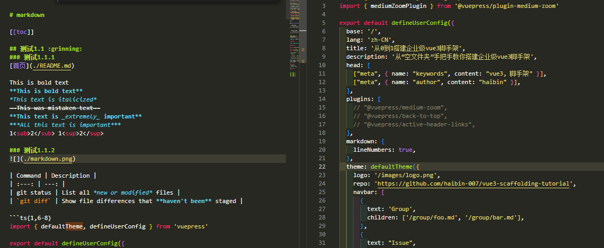

# markdown

<!-- [[toc]] -->

## 测试1.1 :grinning:
### 测试1.1.1
[首页](./README.md)  

This is bold text  
**This is bold text**  
*This text is italicized*  
~~This was mistaken text~~  
**This text is _extremely_ important**  
***All this text is important***  
1<sub>2</sub> 1<sup>2</sup>

### 测试1.1.2 


| Command | Description |
| :---: | ---: |
| git status | List all *new or modified* files |
| `git diff` | Show file differences that **haven't been** staged |

```ts{1,6-8}
import { defaultTheme, defineUserConfig } from 'vuepress'

export default defineUserConfig({
  title: '你好， VuePress',

  theme: defaultTheme({
    logo: 'https://vuejs.org/images/logo.png',
  }),
})
```
@[code ts{1,6-8}:no-line-numbers](./markdown.ts)

```md:v-pre
<!-- 默认情况下，这里会被保持原样 (可省略v-pre) -->
1 + 2 + 3 = {{ 1 + 2 + 3 }}
```

```md:no-v-pre
<!-- 这里会被 Vue 编译 -->
1 + 2 + 3 = {{ 1 + 2 + 3 }}
```

### 测试1.1.3
内置组件：<Badge type="tip" text="v2" vertical="top" /> / ...

_你好， {{ msg }}_

<RedDiv>

_当前计数为： {{ count }}_

</RedDiv>

<button @click="count++">点我！</button>

<script setup>
import { h, ref } from 'vue'

const RedDiv = (_, ctx) => h(
  'div',
  {
    class: 'red-div',
  },
  ctx.slots.default()
)
const msg = 'Markdown 中的 Vue'
const count = ref(0)
</script>

<style>
.red-div {
  color: red;
}
</style>


## 测试1.2
## 测试1.3
## 测试1.4
## 测试1.5


